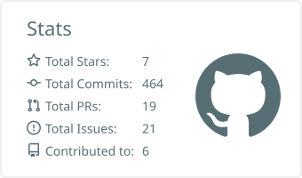
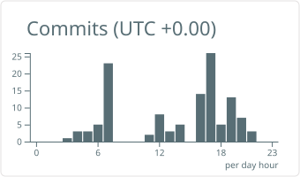

<div align="center">

# Vatsalya Betala

<!-- ⚠️ uncertain — external service; if it ever breaks, delete this line -->


**M.S. Artificial Intelligence @ Columbia University** · Computer Science + Mathematics

[](https://www.linkedin.com/in/vatsalya-betala/)
[](mailto:vatsalyabetala@gmail.com)

</div>

---

I understand things from first principles. When I learn something, I want to know **why it works, where the equation came from, what it assumes, and what breaks when you change those assumptions.**

I'd rather dissect a concept than just apply it. I also optimize things compulsively: models, code, systems, schedules, occasionally things that didn't need it.

---

## 🧭 The question I keep coming back to

We know how to minimize the loss:

```math
\theta^\star = \arg\min_\theta \mathcal{L}(\theta)
```

But in an overparameterized network, $\arg\min$ isn't a point. It's a whole manifold of solutions that fit the data equally well. The optimizer picks one:

```math
\theta^\star = \mathcal{A}\big(\theta_0,\ \mathcal{D},\ \eta,\ \text{architecture}\big) \in \arg\min_\theta \mathcal{L}(\theta)
```

<div align="center">

</div>

**Which one it picks, and why, determines the representation.** That's what decides whether a model learned the disease or the background, the concept or the shortcut.

<table>
<tr>
<td width="50%" valign="top">

**What I'm pulling on**
- Optimization dynamics & implicit bias
- Representation learning
- Interpretability
- Shortcut learning
- Generalization

</td>
<td width="50%" valign="top">

**Open questions on my desk**
- When is a correct prediction *not* evidence of understanding?
- What features does SGD prefer, and is it predictable?
- Can we detect a shortcut before it fails in deployment?

</td>
</tr>
</table>

---

## 🔬 Things I've built

<table>
<tr>
<td width="50%" valign="top">

### 🌱 [PlantGuard](https://github.com/VatsalyaBetala/PlantGuard)
<!-- ⚠️ verify repo URL -->
Interpretable computer vision for plant disease detection.

Accuracy was the easy part. The real question was **what the model was actually looking at**, and whether its predictions came from genuine disease features or from something it shouldn't have been using.

`PyTorch` `Computer Vision` `Interpretability`

</td>
<td width="50%" valign="top">

### 🗓️ [OurClock](https://github.com/VatsalyaBetala/OurClock)
<!-- ⚠️ verify repo URL -->
University scheduling built around real constraints, not toy ones.

This project sent me deep into **optimization and constraint modeling**, and I still haven't fully climbed out.

`Python` `Optimization` `Scheduling`

</td>
</tr>
</table>

---

## ⚙️ How I work

```text
learn it → derive it → implement it → break it → figure out why → repeat
```

---

## 🧰 Toolkit

<!-- ⚠️ uncertain — verify each skillicons ID renders (haskell, julia, r, sklearn, opencv) -->
**Languages**
<br/>


**ML / Scientific Computing**
<br/>

<br/>


**Systems & Data**
<br/>


---

## 📊 GitHub

<div align="center">
<picture>
  <source media="(prefers-color-scheme: dark)" srcset="https://streak-stats.demolab.com?user=VatsalyaBetala&hide_border=true&theme=github-dark-blue&background=00000000" />
  
</picture>
<br/>
<!-- ⚠️ uncertain — generated by .github/workflows/profile-cards.yml; confirm filenames after first run -->
<picture>
  <source media="(prefers-color-scheme: dark)" srcset="./profile-summary-card-output/github_dark/3-stats.svg" />
  
</picture>
<picture>
  <source media="(prefers-color-scheme: dark)" srcset="./profile-summary-card-output/github_dark/4-productive-time.svg" />
  
</picture>
</div>

---

<div align="center">

**Have a weird concept, proof, paper, or idea you want to break down from first principles?**<br/>
If you know something I don't, teach me. If you're stuck on something interesting, let's dissect it together.

</div>
